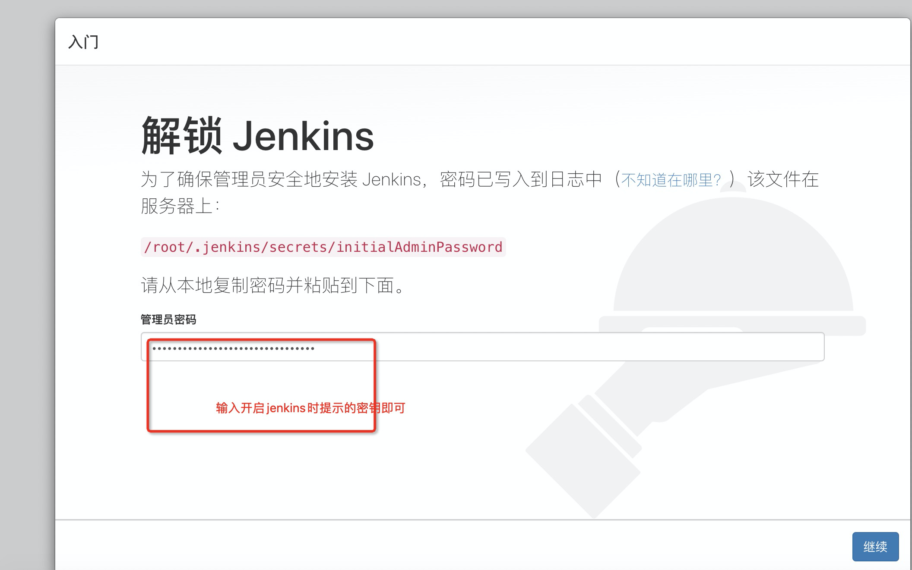

> 000 首选要安装JDK

- 服务器自行安装jdk8即可

> 001 下载jenkins

- [官网](https://jenkins.io/zh/)
- [可以下载清华大学镜像](https://mirrors.tuna.tsinghua.edu.cn/)

> 002 war包安装

- https://www.cnblogs.com/xiaokuangnvhai/p/11338781.html

> 003 启动jenkins 和配置

- 安装包上传到服务器 
    - war 包安装你需要 `java -jar  jenkins.war`
    - rpm包安装只需要这样 `rpm -ivh jenkins-2.99-1.1.noarch.rpm`  **我用的 rpm包**
- 启动 systemctl start jenkins 
    - 会有报错 参考 https://blog.csdn.net/weixin_40816738/article/details/91391925
- 开机自启动 systemctl enable jenkins 
- 查看 jenkins 状态 `systemctl status  jenkins`
```
出现这样代表成功启动了
● jenkins.service - LSB: Jenkins Automation Server
   Loaded: loaded (/etc/rc.d/init.d/jenkins; bad; vendor preset: disabled)
   Active: active (running) since Sun 2020-04-19 18:53:16 CST; 49s ago
     Docs: man:systemd-sysv-generator(8)
   CGroup: /system.slice/jenkins.service
           └─12266 /usr/java/jdk1.8.0_251/bin/java -Dcom.sun.akuma.Daemon=daemonized -Djava.awt.headless=true -DJENKINS_HOME=/var/lib/jenkins -jar /usr/lib/jenk...

Apr 19 18:53:16 iZ8vb1bcoekt3bizan2wt9Z systemd[1]: Starting LSB: Jenkins Automation Server...
Apr 19 18:53:16 iZ8vb1bcoekt3bizan2wt9Z runuser[12087]: pam_unix(runuser:session): session opened for user jenkins by (uid=0)
Apr 19 18:53:16 iZ8vb1bcoekt3bizan2wt9Z jenkins[12081]: Starting Jenkins [  OK  ]
Apr 19 18:53:16 iZ8vb1bcoekt3bizan2wt9Z systemd[1]: Started LSB: Jenkins Automation Server.
```
- 放行 8080 端口 访问即可
- 输入 命令行里提示的密钥进去 ,密码在提示的路径里




也可以直接点击右上角的叉,进入系统里 右上角选择用户 修改密码


- 设置镜像
- https://blog.csdn.net/you227/article/details/81076032

```
jenkins插件清华大学镜像地址
https://mirrors.tuna.tsinghua.edu.cn/jenkins/updates/update-center.json
```


> 004 安装插件

三种方式 

- 一个是从插件列表里搜
- 一个是从 jenkins 官网下了之后上传
- 最后一个是直接把安装好插件的jenkins覆盖到 你新的机器的jenkins 的插件目录
- jenkins 所有插件都在这个位置 `/var/lib/jenkins/plugins`
- 拷贝你的包到这个目录
- 然后重启 jenkins `systemctl restart jenkins`


> 资源地址

- 链接：https://pan.baidu.com/s/14yF2hgsHfnv6Q7bTO5OE7A 
- 提取码： ufbr

