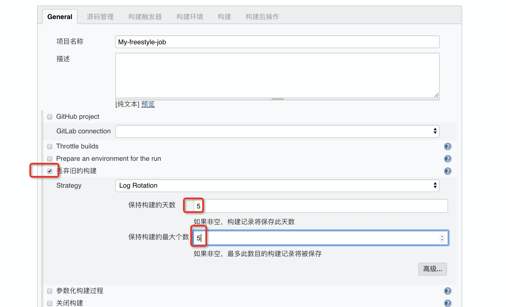
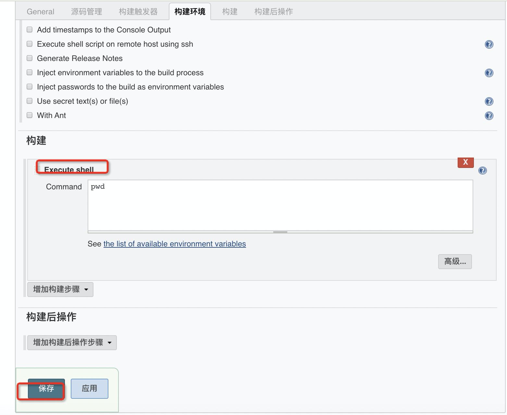
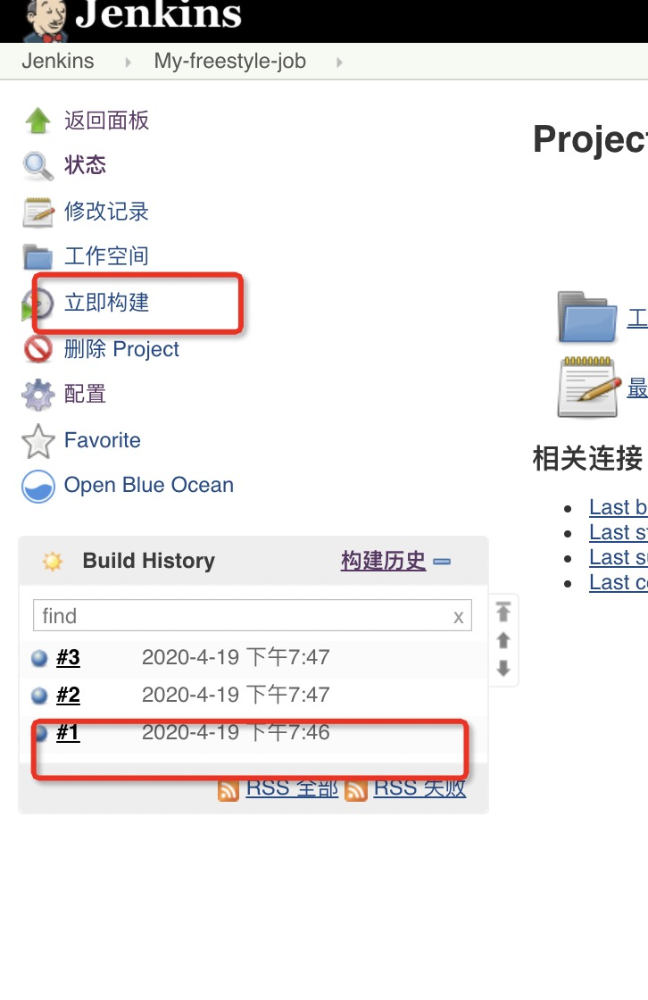
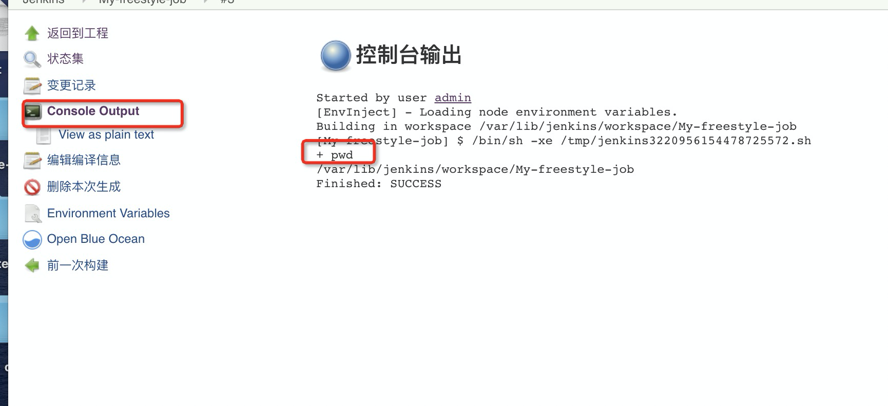

## 构建任务

- 新建任务名称 最好根据类型为名如 `My-freestyle-job`
- 不要轻易改任务名字
    - 新建之后 就会产生一个文件夹 如 My-freestyle-job
    - 如果你改名字 ，改成 aaa 那么 `My-freestyle-job` 不会被删除
    - 而是生成一个新的文件夹 aaa
    - 你创建以后 就会在 
    - `/var/lib/jenkins/jobs`里有那么一个文件夹

### 新建一个任务

- 名称为 `My-freestyle-job`
- 选择 自由风格
- 一些必须要配置的东西
    - 勾选 丢弃旧的构建，不然日积月累 磁盘空间就很大了
    - 保持构建天数 5
    - 保持构建的最大个数 5
- 潜规则：假设你构建20次 只有第二次成功了，那么虽然你选择是 保留5天，那么只会保留 第二次构建成功的内容






当前工作目录就是 `/var/lib/jenkins/workspace/My-freestyle-job`

> 一个问题

- 假设脚本里的是 ` useradd abc` 会没有权限，解决办法
    - 手动授权
    - 或者修改当前用户为 root
- 修改 `/etc/sysconfig/jenkins` 文件
```
# 从安全性考虑 毕竟部署在内网。没必要那么麻烦
JENKINS_USER="root"
```
- 重启jenkins `systemctl restart jenkins`