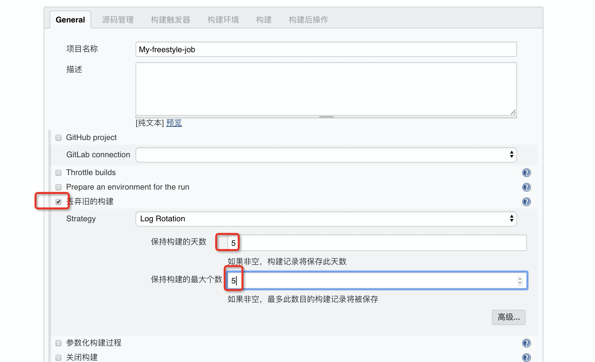
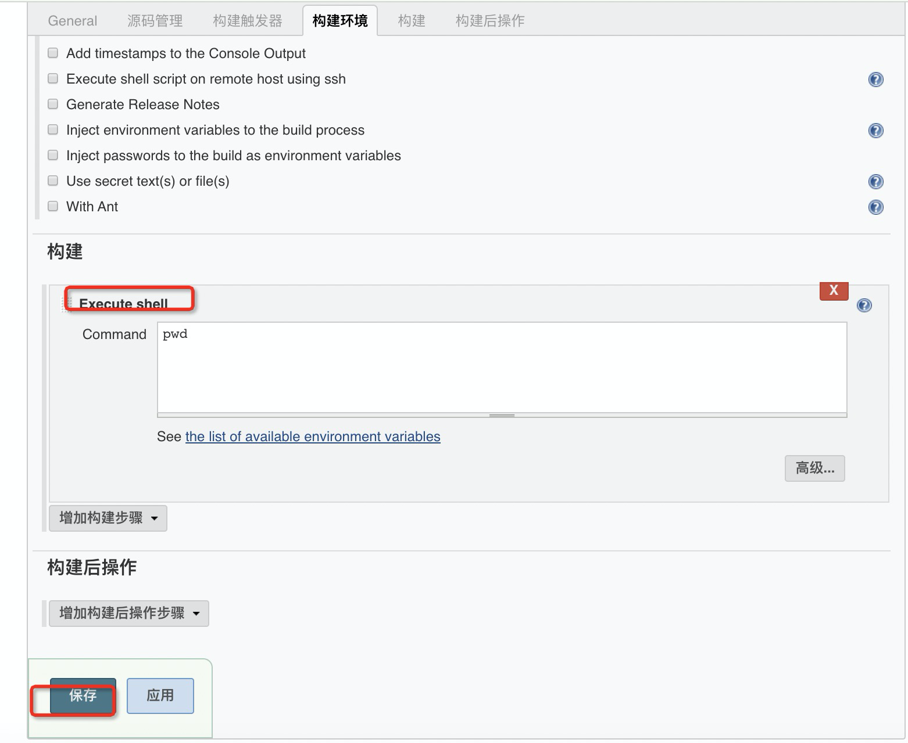
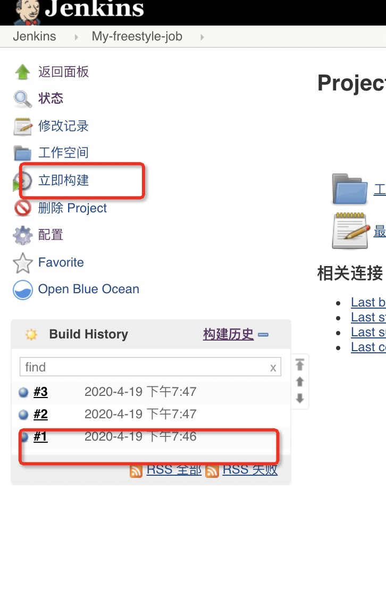
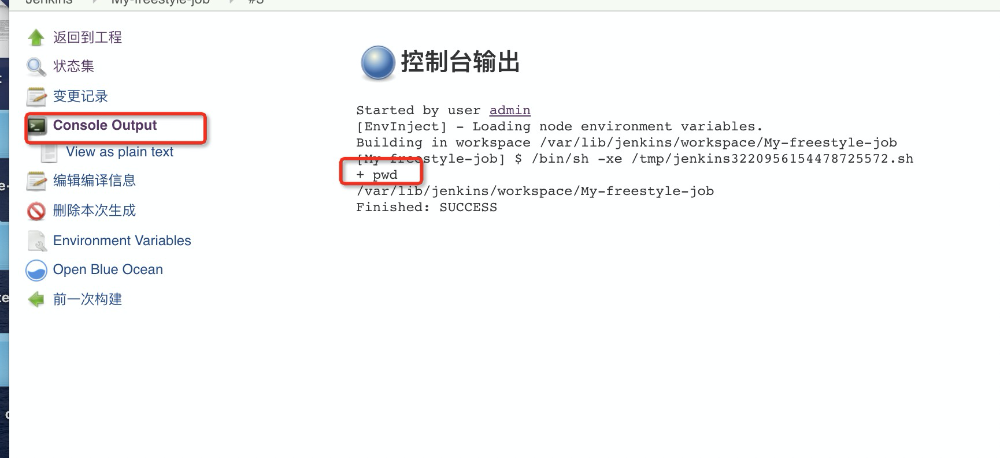

### 构建git代码的任务

> 新建一个任务

- 名称为 `My-freestyle-job`
- 选择 自由风格
- 一些必须要配置的东西
    - 勾选 丢弃旧的构建，不然日积月累 磁盘空间就很大了
    - 保持构建天数 5
    - 保持构建的最大个数 5
- 潜规则：假设你构建20次 只有第二次成功了，那么虽然你选择是 保留5天，那么只会保留 第二次构建成功的内容






**修改这个构建信息**

从一个仓库克鲁代码 选择 ssh方式


解决本地没有密钥的问题

> 三种方式添加 key

- 当前服务器添加 key

```
ssh-keygen -t rsa
敲三次会车

cat /root/.ssh/id_rsa.pub

此时得到公钥 配置到你的 github 上
右上角 用户 点击 settings => SSH and GPG keys

# 验证key
ssh -T git@github.com

Are you sure you want to continue connecting (yes/no)? yes
```
- https://sltrust.github.io/2017/10/05/N004_1_git%E5%85%A5%E9%97%A8/

此时保存我们的构建 从新进入 那个错误提示就没了

> 方式二

- Credentials 那 点击 add => Jenkins


手动添加后，Credentials 那选择 你刚刚添加的那个

> 方式三 

- Credentials 那 点击 add => Jenkins
- 选择 账号密码登录 输入的 github 账号密码


### 参考链接

- [jenkins 从git拉取代码](https://blog.csdn.net/sunny_happy08/article/details/81982900)


