## 构建触发器

- 触发远程构建(例如,使用脚本)
- Build after other projects are built  
    - 在另一个job执行完了构建
    - 有依赖的项目  如 A 依赖 B先构建完成
- Build periodically  
    - 根据日程表的任务执行
- Build when a change is pushed to GitLab. GitLab CI Service URL: http://47.92.248.205:8080/project/My-freestyle-job	
    - 当一个改变被推到 gitlab 就会执行
    - Enabled GitLab triggers	
 	    - Push Events 只要收到push事件就执行
 	    - Opened Merge Request Events 只要合并就触发
 	    - Accepted Merge Request Events		
        - Closed Merge Request Events		
        - Rebuild open Merge Requests		
 	    - Comments		
 	    - Comment (regex) for triggering a build
- GitHub hook trigger for GITScm polling	
- Poll SCM
    - 也是根据日程表的任务执行，而且它会去检查你的代码仓库 有没有更新，更新了就执行构建

#### gitLab 触发构建

-  我们选用 `Build when a change is pushed to GitLab.`

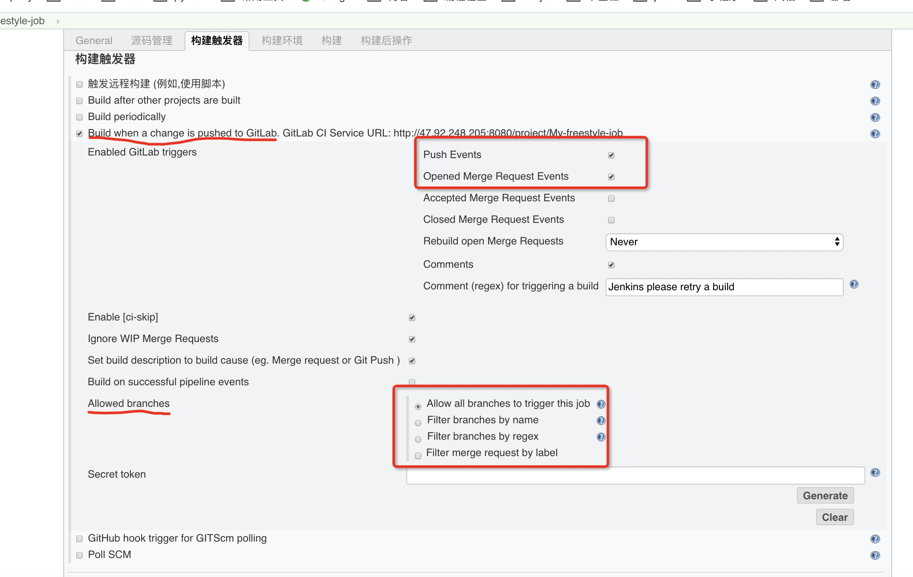

- 如果你上面的**Branches to build** 选择的 master
    - 如图的高级选项里 **Allowed branches** 即使选了 Allow all branches to trigger this job 你在 非 master操作也不会触发
- 如果你上面的**Branches to build** 选择的 master
    - 在如图的高级选项里 你可以在 Filter branches by name 里配置你的规则
- 上面的 Build when a change is pushed to GitLab. GitLab CI Service URL: http://47.92.248.205:8080/project/
    - 这个 URL 意思是 你可以通过 URL就触发
        - 但并不是所有人有这个 URL就可以触发
        - 你需要生成 key ==> Secret token 里点击按钮 Generate
- [gitlab自动化触发jenkins构建项目](https://blog.csdn.net/qq_34605594/article/details/73980694)

#### GitHub 触发构建

- https://blog.csdn.net/qq_35566908/article/details/103149181

**务必要看这个**
**务必要看这个**
**务必要看这个**

#### Github中获取访问token值,需要一个对项目有写权限的账户

GitHub->setting->Developer setting->Personal access tokens->点击Generate new token
内容填写如下

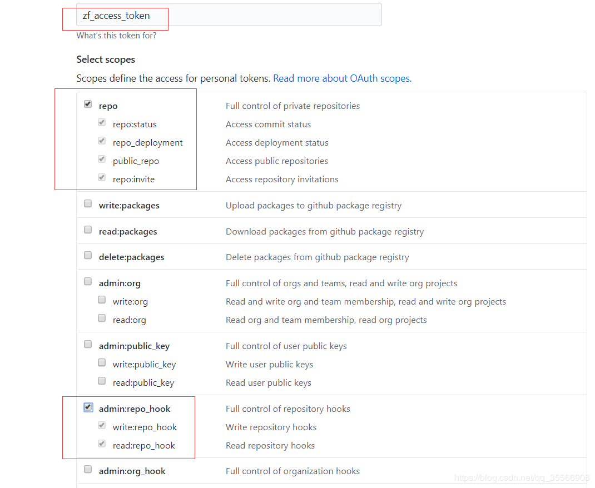
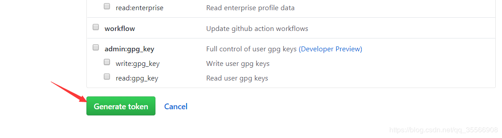

复制生成的access token

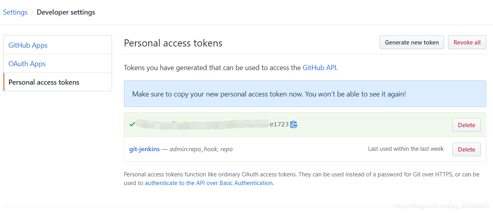

#### Jenkins中Github配置中添加token凭证

系统管理 -> 添加Github server -> 添加Secret text凭证 -> 连接测试
同时，勾选为github指定另外一个hook url（配置Jenkins在Hook URL中监听Github的Post请求，然后进行自动构建）

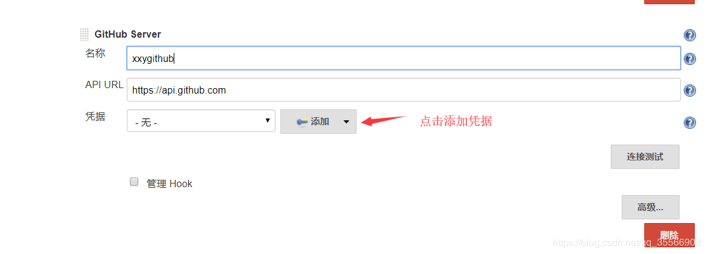
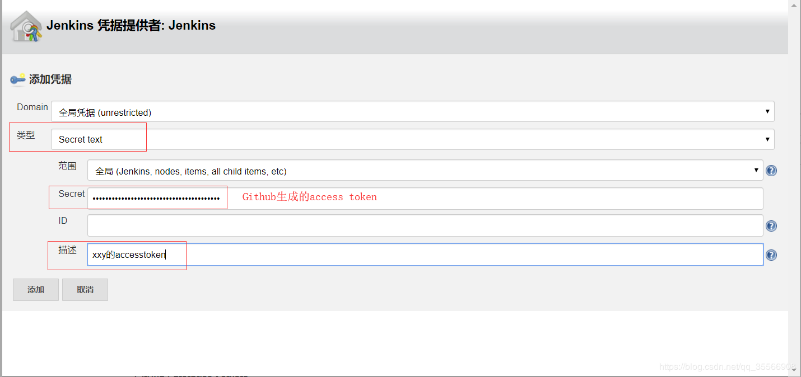
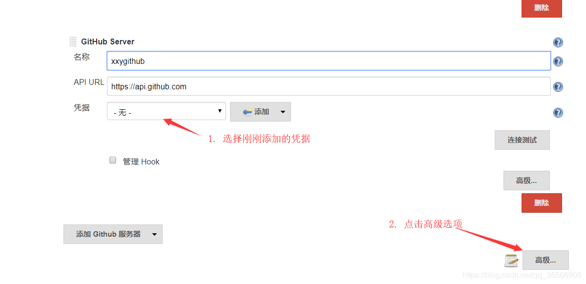

注意：在操作过程，点击连接测试，可能会提示：Failed to validate the account，首先请确保添加凭证的类型是Secret text，其次secret值填写的是步骤1中生成的token值

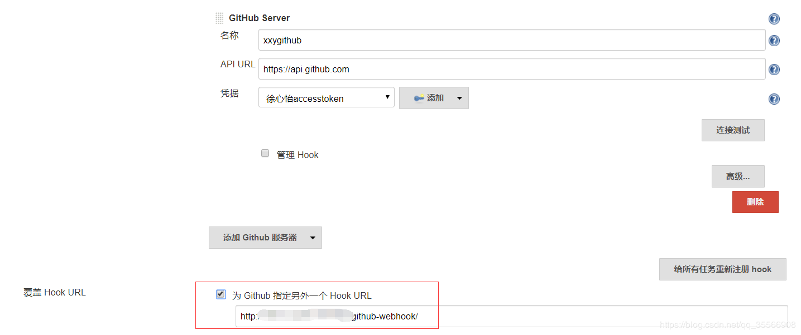

#### Github中项目配置webhook
settings -> webhooks -> Add webhook0

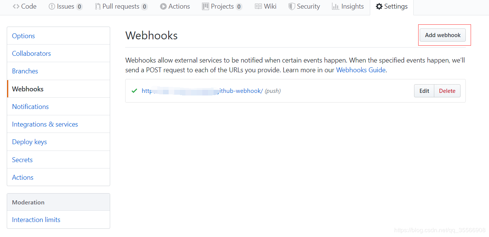

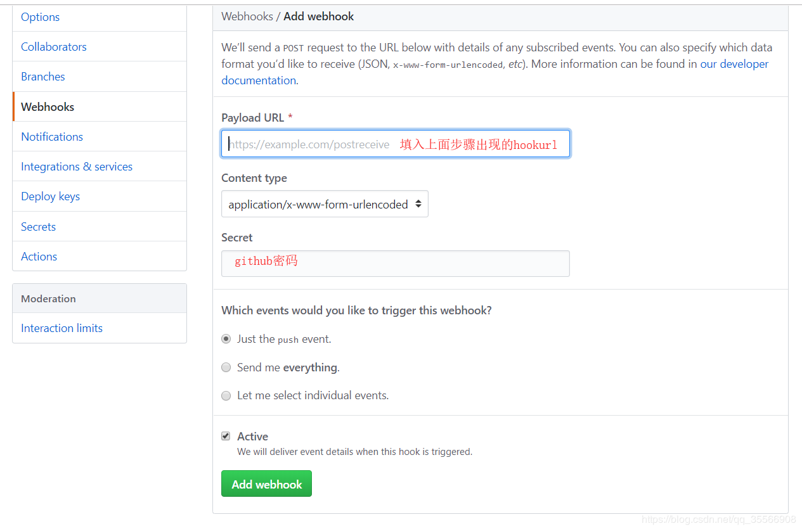

jenkins项目中进行配置

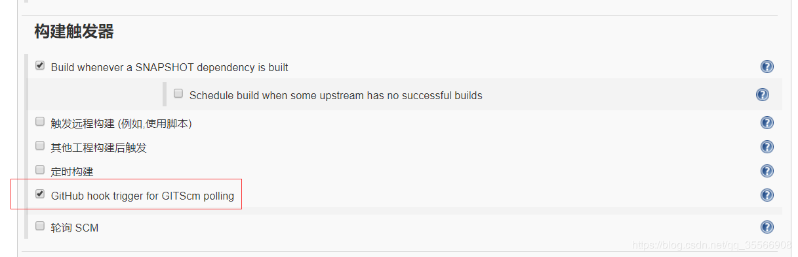

#### 参考链接

- https://www.jianshu.com/p/07b60b788088