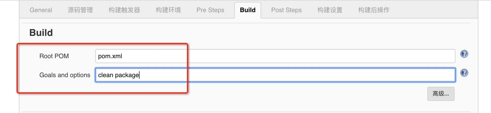

### jenkins添加本地maven

```
系统管理 => 全局工具配置 => maven

# 取消自动安装 因为我们之前本地安装过了

name: maven
MAVEN_HOME: /usr/local/maven

# 保存即可
```

**同理 把 jdk也添加上** 不然提示你找不到 java

### 新建构建job





把hello-world 项目上传你的 github 仓库里


点击保存，然后执行构建

